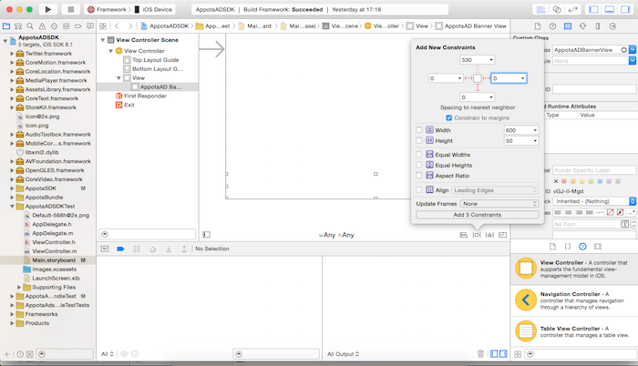
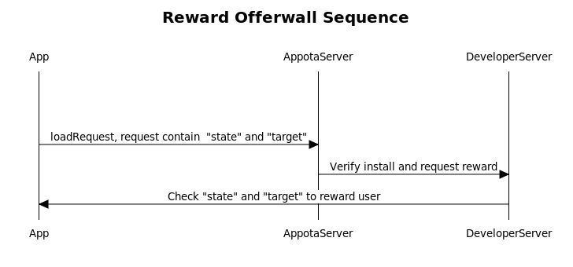

AppotaADSDK for iOS
====
This is version 1.01 of AppotaADSDK for iOS. Every ads setting and ad unit will be create and manage on [https://ads.appota.com](https://ads.appota.com)

## Overview
1. [Configuration](#1-configuration)
2. [Banner](#2-banner)
	- [Setup ad banner](#21-setup-ad-banner)
	- [Delegate](#22-delegate)	
3. [Interstitial Ad](#3-interstitial-ad)
	- [Setup interstitial banner](#31-setup-interstitial-banner)
	- [Delegate](#32-delegate)
4. [Offerwall Ad](#4-offerwall-ad)
	- [Setup](#41-setup-offerwall-ad)
	- [Delegate](#42-delegate)
	- [How user get reward](#43-how-user-get-reward)
5. [Native ads](#5-native-ads)
 	- [AppotaADNative class](#51-appotaadnative-class)
 	- [AppotaADNativeObject class](#52-appotaadnativeobject-class)

## 1. Configuration
- Add `AppotaADSDK.framework` and `AppotaADBundle.bundle` to your project
- Add other frameworks that the SDK requires

	- AdSupport
	- AudioToolbox
	- AVFoundation
	- CoreGraphics
	- CoreMedia
	- CoreTelephony
	- StoreKit
	- SystemConfiguration
- Configure project `.plist` add key `AppotaAPIKey` using key from developer page
- In `AppDelegate`:
	- import SDK: `#import <AppotaADSDK/AppotaADSDK.h>`
	- Init SDK in `application:didFinishLaunchingWithOptions:`
	
	```
	[AppotaADSDK init];
	```
	
	- in `applicationWillResignActive:`
		
	```
	[AppotaADSDK resignActive];

	```
	
	- in `applicationDidBecomeActive:`
	
	```
	[AppotaADSDK becomeActive];
	```
- `AppotaADRequest` class has `isDevelopmentMode` property to config state of current application is in development (testing or production).

## 2. Banner
Now that you have a project with the SDK referenced, let's put banner ads into it. There are 2 ways to add banner by interface builder or programmatically. 
- Add `AppotaADBannerView` to interface builder and add constraint

- Or init `AppotaADBannerView` and add to view programmatically

```
bannerView = [[AppotaADBannerView alloc] initWithAdSize:APPOTA_SMART_BANNER_SIZE origin:CGPointMake(0, 0)];
[self.view addSubview:bannerView];

```
There are 2 options for banner size `APPOTA_BANNER_SIZE` which is fixed and `APPOTA_SMART_BANNER_SIZE` which is adaptively fit your side screen

### 2.1 Setup ad banner
Use `adUnitID` from ad CMS to make ad request, pass any value `state` to send to Appota server to identify the ad. Set `rootViewControlelr` and `delegate` for ad banner

```
    bannerView.adUnitID = @"YOUR_AD_UNIT";
    AppotaADRequest *request = [AppotaADRequest request];
    request.state = @"state";
    bannerView.delegate = self;
    bannerView.rootViewController = self;    
    [bannerView loadRequest:request];    
```
### 2.2 Delegate
There are 2 delegate call :

- `adViewDidReceiveAd:` called when delegate received ad and will display it

```
- (void) adViewDidReceiveAd:(AppotaADBannerView *)view;

```

- `adView:didFailToReceiveAdWithError:` called when fail to receive ad, print the error information to get the reason

```
- (void) adView:(AppotaADBannerView *)view didFailToReceiveAdWithError:(AppotaADRequestError *)error
```

- `adViewDidClick:` called when user did click on banner

```
- (void) adViewDidClick:(AppotaADBannerView *)adView;
```

## 3. Interstitial Ad
Interstitial will display a full banner in your app. 
### 3.1 Setup interstitial banner
Call `initWithAdUnitID:` and set `delegate`, `rootViewController`

```
interstitial = [[AppotaADInterstitial alloc] initWithAdUnitID:@"YOUR_AD_UNIT_ID"];
interstitial.delegate = self;
interstitial.rootViewController = self;
    
```

Then call `loadRequest:` when you want to display your interstitital ad

```
AppotaADRequest *request = [AppotaADRequest request];
request.state = @"YOUR_STATE";
[interstitial loadRequest:request];    

```

### 3.2 Delegate

- Called when an interstitial ad request succeeded.

```

- (void)interstitialDidReceiveAd:(AppotaADInterstitial *)ad;

```

- Called when an interstitial ad request completed without an interstitial to
show, print the error for more information

```
- (void)interstitial:(AppotaADInterstitial *)ad didFailToReceiveAdWithError:(AppotaADRequestError *)error;

```


- Called when ad did click

```
- (void)interstitialDidClick:(AppotaADInterstitial *)ad;

```

- Called just after dismissing an interstitial and it has animated off the screen.

```
- (void)interstitialDidDismissScreen:(AppotaADInterstitial *)ad;

```

##4. Offerwall Ad
Offerwill will display fullscreen ad with list of offer and reward
### 4.1 Setup offerwall ad

Call `initWithAdUnitID:` and set `delegate`, `rootViewController`

```
offerWall = [[AppotaADOfferWall alloc] initWithAdUnitID:@"YOUR_AD_UNIT_ID"];
offerWall.delegate = self;
offerWall.rootViewController = self;
    
```

Then call `loadRequest:` when you want to display your offerwall ad, pass `state` to your request, it'll be used to identify user and reward them after install ad by IPN

```
AppotaADRequest *request = [AppotaADRequest request];
request.state = @"YOUR_STATE";
[offerWall loadRequest:request];    

```

### 4.2 Delegate
- Called when an offerwall ad request succeeded.

```

- (void)offerWallDidReceiveAd:(AppotaADOfferWall *)ad;

```

- Called when an offerwall ad request completed without an offerwall to
show, print the error for more information

```
- (void)offerWall:(AppotaADOfferWall *)ad didFailToReceiveAdWithError:(AppotaADRequestError *)error;

```


- Called when ad did click

```
- (void)offerWallDidClick:(AppotaADOfferWall *)ad;

```

- Called just after dismissing an offerwall and it has animated off the screen.

```
- (void)offerWallDidDismissScreen:(AppotaADOfferWall *)ad;

```
### 4.3 How user get reward

- Reward machenism will follow this char


Add your information which need to reward user (`userID`, game info, ...) to `state` and `target` property in `AppotaADRequest` object, this information will be passed to your server after user finish their quest in offerwall

```
AppotaADRequest *request = [AppotaADRequest request];
request.state = @"game_1";
request.target = @"user1";

```

- Set your server address to reward user on [http://ads.appota.com](http://ads.appota.com). Here is a sample of simple server [IPN](ipn.php)

## 5. Native ads
Our SDK also support native ads. Native ADS api will return ads data and developer can use custom UI to display the data.
### 5.1 AppotaADNative class
- Call `loadRequest:withCompletionBlock:withErrorBlock:(AppotaADErrorBlock) errorBlock;

```
    AppotaADRequest *request = [AppotaADRequest request];
    request.adType = AppotaADTypeInterstitial;
    request.adUnitID = @"44";
    [AppotaADNative loadRequest:request
            withCompletionBlock:^(NSArray *list) {
                if (list.count > 0) {
                    AppotaADNativeInterstitialObject *obj = list[0];
                    NSLog(@"%@",[obj getImageURL]);
                }
            } withErrorBlock:^(NSError *error) {
                
    }];
      
```

- Set `adType`, `adUnitID` to `request`

This function will return list of `AppotaADNativeObject` object

- Call `click:withRootViewController:` when user click on an item in your custom view

### 5.2 AppotaADNativeObject class
- `ADNativeViewObject`, `ADNativeInterstitialObject`, `ADNativeOfferWallObject` 's inhertiged from `ADNativeObject` each will represent an adobject use to display on your custom UI ad

- `ADNativeObject`

```
	// Get adID
	- (NSString*) getID;
	
	- (NSString*) getName;
	
	- (NSString*) getImageURL;
	
	- (NSString*) getIconURL;
	
	// Return display type icon or screen
	- (NSString*) getType;
	
	- (NSString*) getAction;
	
	- (NSString*) getDescription ;
```

- `ADNativeViewObject`

- `ADNativeInterstitialObject`

- `ADNativeOfferWallObject`

```
	- (NSString*) getPoint;
	- (NSString*) getCurrency;	
```